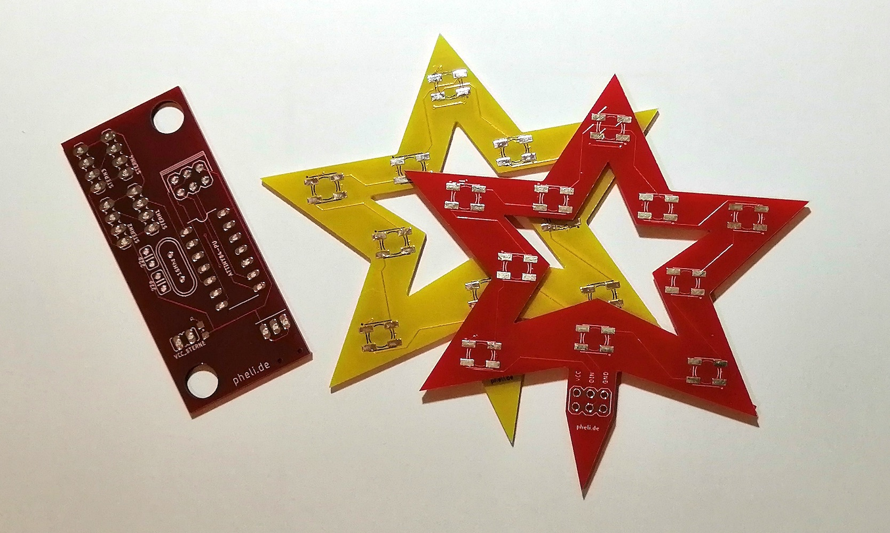
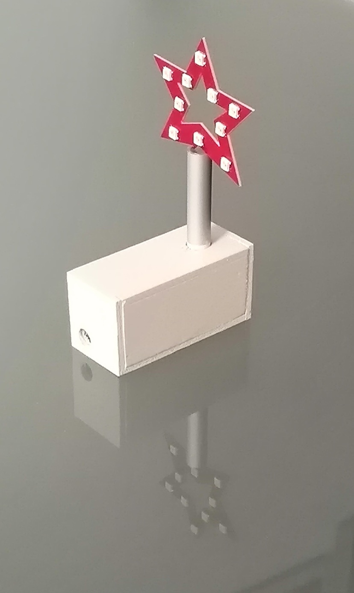
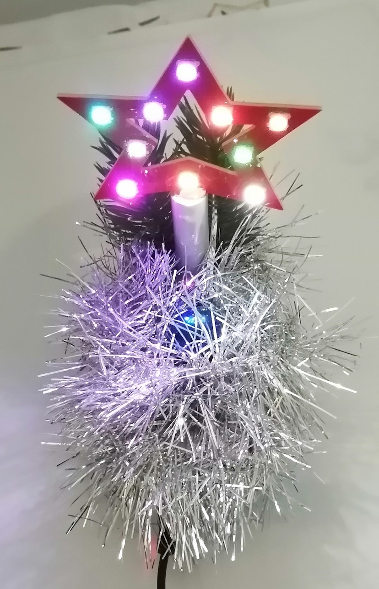
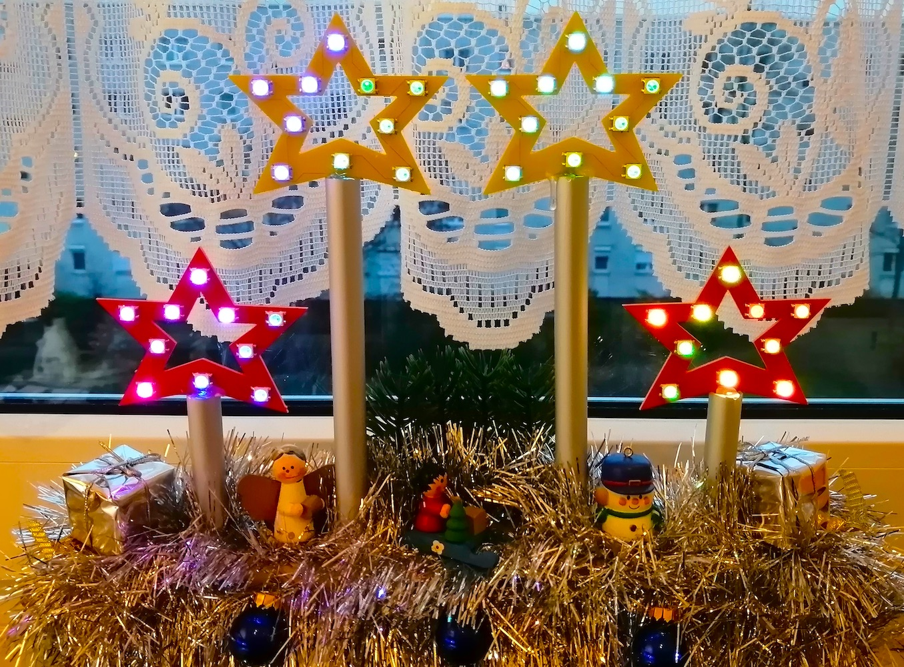

# Schneeflocken-mit-ws2812b
Deko 2020 mit ws2812b und dem Attiny84

Die Platinen 

Nach dem Zusammenbau 

Zum Schluß mit Deko 

Das ganze ist skalierbar. Vier Sterne mit Deko, schon am Fenster aufgestellt. 

Programmiert habe ich das mit der Arduinoumgebung mit der FastLED Bibliothek, da gibt es Anleitungen massenhaft im Netz.
